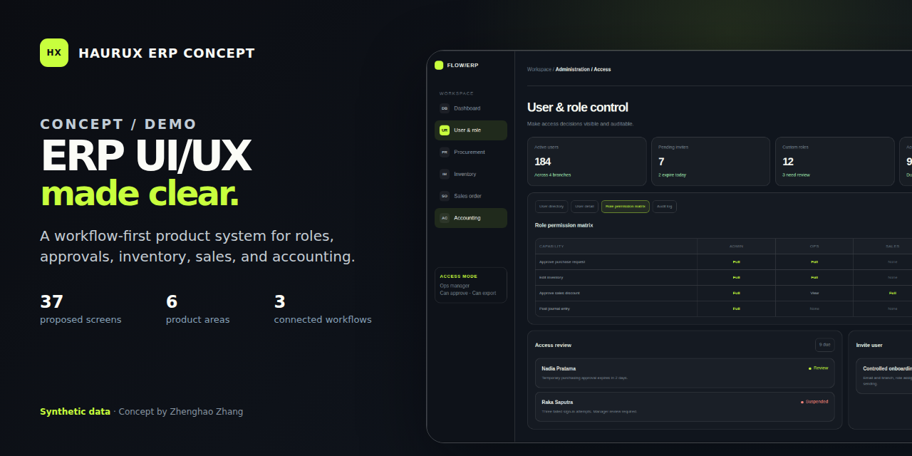
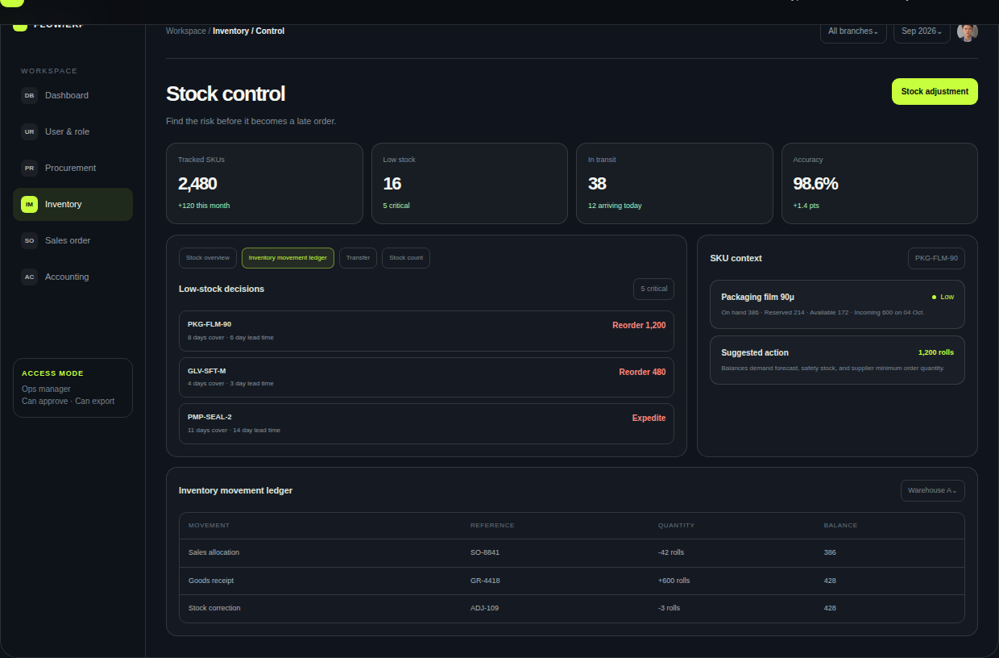
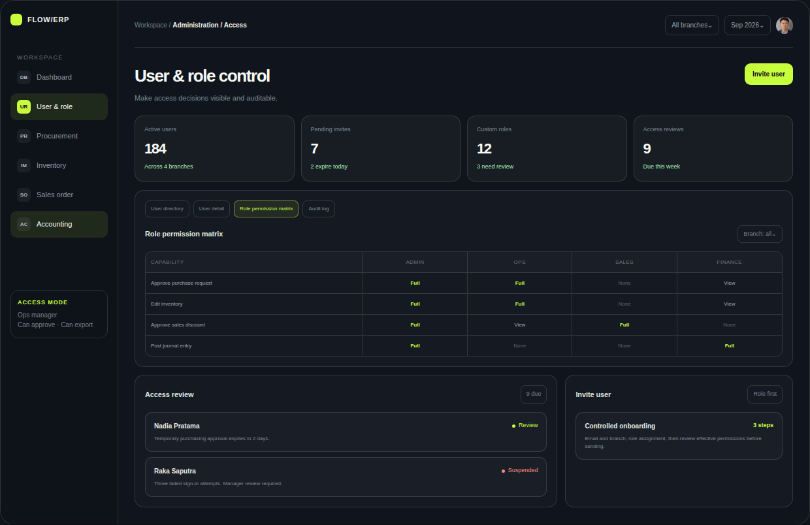
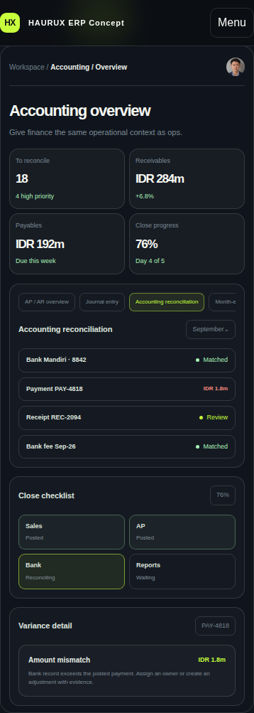

# ERP UI/UX Concept Portfolio

[English](CASE_STUDY.md) | [Simplified Chinese](CASE_STUDY.zh-CN.md)

**HAURUX ERP Concept** 
**Designer and developer:** Zhenghao Zhang 
**Project type:** Concept / Demo 
**Focus:** ERP information architecture, connected workflows, role-aware controls, responsive interfaces, and design systems

[Live Demo](https://zhang-zhenghao.github.io/haurux-erp-portfolio/) | [Download PDF](https://zhang-zhenghao.github.io/haurux-erp-portfolio/assets/HAURUX_ERP_UIUX_Portfolio.pdf) | [Repository Overview](README.md) | [Chinese Demo](https://zhang-zhenghao.github.io/haurux-erp-portfolio/zh/) | [Chinese PDF](https://zhang-zhenghao.github.io/haurux-erp-portfolio/assets/HAURUX_ERP_UIUX_Portfolio_zh-CN.pdf)

## Context

This self-initiated case study translates a limited public ERP UI/UX brief into a concrete system proposal. The brief named the core areas, but it did not include an existing product audit, user research, process documentation, field definitions, or production data.

The design question was therefore not simply, "What should an ERP dashboard look like?" It was, "How can one interface preserve responsibility, business context, and traceability as work passes between people and modules?"

The response has four evidence layers:

1. A 37-screen information architecture that makes the proposed scope inspectable.
2. Three cross-module workflows that expose handoffs and exceptions.
3. Six interactive prototype views covering Dashboard, User & Role, PR / PO, Inventory, Sales, and Accounting.
4. A reusable visual and state system for dense operational interfaces.

This case study documents the reasoning behind that response. It does not present the concept as completed client work.

## Constraints and Assumptions

### What the brief established

- The product is a responsive web ERP.
- The scope needs User and Role administration, Sales, PR / PO, Inventory or IMS, and Accounting.
- The modules must behave as a connected system rather than isolated visual pages.
- The work needs enough structure to support design review and eventual developer handoff.

### What was not available

- Current product screens or analytics.
- Stakeholder interviews or observed user tasks.
- Final roles, reporting lines, and approval thresholds.
- Entity definitions, required fields, validation rules, and terminology.
- Tax, currency, inventory valuation, localization, or accounting policies.
- Integration constraints for identity, banking, logistics, or existing ERP services.
- A production accessibility audit or task-based usability study.

### Working assumptions

The concept assumes a desktop-first operational product that still supports focused work at tablet and mobile widths. Admin, Sales, Procurement, Warehouse, Finance, and Approver are illustrative roles. Approval rules may depend on amount, department, warehouse, or risk. Every record shown uses synthetic data.

These assumptions make the concept reviewable. They are hypotheses to validate, not settled production requirements.

## Information Architecture

The proposed architecture contains **37 distinct screens** across six areas. A screen is defined as a job-focused route or workspace. A modal, drawer, filter, loading condition, permission variant, or validation message is a component state and is not counted as another screen.

| Range | Area | Count | Proposed screens |
| --- | --- | ---: | --- |
| 01 to 05 | Foundation & Navigation | 5 | 01 Sign in and account recovery; 02 My profile and preferences; 03 Global search and quick actions; 04 Notification center; 05 Activity and audit log |
| 06 to 10 | User & Access | 5 | 06 User directory; 07 Create or edit user; 08 User detail and activity; 09 Roles and permissions; 10 Access review queue |
| 11 to 18 | Sales | 8 | 11 Sales dashboard; 12 Customer list; 13 Customer detail; 14 Quotation list; 15 Create or edit quotation; 16 Sales order list; 17 Sales order detail; 18 Fulfilment and delivery |
| 19 to 26 | PR / PO | 8 | 19 Purchase request list; 20 Create or edit purchase request; 21 Purchase request detail and approval; 22 Request for quotation; 23 Vendor comparison; 24 Purchase order list; 25 Purchase order detail; 26 Goods receiving |
| 27 to 32 | IMS / Inventory | 6 | 27 Inventory dashboard; 28 Item master list; 29 Item detail and stock card; 30 Warehouse and bin view; 31 Stock transfer; 32 Adjustment and cycle count |
| 33 to 37 | Accounting | 5 | 33 Accounting dashboard; 34 Accounts payable and bills; 35 Accounts receivable and invoices; 36 Journal entries; 37 Bank reconciliation |

The 5 + 5 + 8 + 8 + 6 + 5 structure creates a planning baseline without pretending that every modal is a separate deliverable. It also exposes where discovery may change the count. For example, multi-company accounting, complex warehouse topology, or regional tax rules could split a proposed workspace into several routes.

The map is organized around work rather than department labels alone. Foundation capabilities support every module. Business records link forward and backward so a reviewer can move from an approval to its request, from a receipt to its purchase order, or from a reconciliation variance to its payment record.

The 37-screen map represents proposed scope. The live prototype demonstrates selected high-value views and reusable patterns, not 37 completed production screens.

## Key Workflows

### 1. Purchase request to purchase order to stock

**Purchase Request -> Approval -> RFQ and Compare -> Purchase Order -> Goods Receipt -> Stock and Match**

The requester begins with purpose, item, quantity, and cost-center context. An approval route is then selected from the proposed amount and policy rules. Procurement compares vendor price, lead time, terms, and tax on a consistent basis before converting the approved selection into a controlled purchase order.

At receipt, Warehouse records delivered quantity, lot or serial context where relevant, variance, and supporting evidence. Inventory receives the physical movement, while Finance gets the source chain needed for purchase order, goods receipt, and invoice matching.

The prototype keeps approval context beside the decision. It also surfaces budget holds, price variance, quantity variance, partial receiving, and missing proof as exceptions that need an owner instead of hiding them in free-form notes.

### 2. Sales order to fulfilment

**Sales Order -> Pick -> Pack -> Ship**

Sales defines the customer promise. Warehouse needs the same record translated into available inventory, picking work, packing progress, and dispatch evidence. A shared status model prevents Sales and Warehouse from maintaining different versions of the truth.

The fulfilment board groups orders by stage and highlights at-risk work. A stock gap can lead to a split shipment or substitute decision. A discount outside a proposed limit requires a reason and approval. Shipment retains tracking and proof so downstream invoicing can reference what was actually delivered.

This flow is deliberately more than a Kanban layout. Each stage needs an owner, a meaningful completion condition, a visible exception, and a route back to the source order.

### 3. Inventory alert to reorder

**Alert -> Review -> Reorder -> Track**

A low-stock signal is only useful if it leads to a defensible action. The review combines available quantity, reservations, forecast demand, safety stock, supplier lead time, minimum order quantity, and incoming supply. The interface then presents a suggested quantity with the context behind it.

Before a new request is raised, the user should see open purchase requests and purchase orders to reduce duplicate buying. After approval, the same thread follows the expected arrival and final receipt. The movement ledger preserves the references that explain each balance change.

## Roles, Permissions, and States

The permission model uses five explicit capability levels: **View**, **Create or process**, **Approve**, **Manage**, and **No access**. Page visibility alone is not enough. Posting a journal, approving a discount, exporting sensitive data, voiding a document, and adjusting stock may each need a different rule.

| Illustrative role | Primary responsibility in the concept |
| --- | --- |
| Admin | Users, roles, master data, audit, and system settings |
| Sales | Customers, quotations, orders, and fulfilment visibility |
| Procurement | Request review, vendor comparison, and purchase order preparation |
| Warehouse | Receiving, stock movement, transfer, and cycle count |
| Finance | Bills, invoices, journals, payment, and reconciliation |
| Approver | Threshold-based review, approval, rejection, or delegation |

The proposed access experience follows four rules:

1. Show effective permissions before a role change is activated.
2. Explain whether a record is locked by permission, approval state, or accounting period.
3. Store the actor, time, reason, evidence, and previous value for material changes.
4. Keep rejected, delegated, expired, and suspended states recoverable and understandable.

Document status and interface status are separate. A purchase request may be awaiting approval while its detail view is loading. A posted journal may be complete but read-only. The system therefore needs both business lifecycle states and consistent interface states:

- **Empty:** explain why no records appear and offer a useful next action or import path.
- **Loading:** preserve the shape and context of the page while preventing duplicate submission.
- **Error:** state what failed, what input was preserved, and how to retry or get support.
- **Read-only:** name the permission or document condition that prevents editing.
- **Approval:** show owner, sequence, current step, evidence, due state, and the consequences of each decision.

These behaviors are part of the component model. They should not be rediscovered independently on every screen.

## Design Decisions

### Put decisions before totals

The operational dashboard prioritizes orders at risk, low stock, overdue approvals, and reconciliation work. Summary numbers remain useful, but each signal needs a path to action.

### Keep evidence beside approval

An approval screen should not force a manager to search another module for budget, demand, price history, or the current step. The selected request, policy context, evidence, and approval path appear together.

### Treat status as shared product language

The same status should keep the same label, meaning, and visual treatment across dashboards, lists, details, and reports. Color is reinforcement, not the only carrier of meaning.

### Make dense data predictable

Operational users often need tables, not decorative cards. Stable column logic, saved views, filters, bulk actions, sticky totals, aligned numbers, and progressive detail help density remain usable.

### Preserve source links across modules

Orders, receipts, stock movements, invoices, payments, and adjustments should remain connected. A user investigating a variance needs the source chain, not a disconnected status message.

### Design a system, not 37 isolated compositions

Shared tokens and variants cover navigation, tables, forms, actions, status, feedback, and responsive behavior. Reusing those rules reduces inconsistency as the screen inventory expands.

## Responsive and Accessible by Design

The concept is desktop-first because complex comparison and reconciliation tasks benefit from width. Responsive design does not mean squeezing the same table until it fits. It means preserving the decision and changing the presentation.

The working prototype demonstrates this strategy:

- At medium widths, primary two-column layouts become a single reading flow.
- At narrow widths, navigation collapses, prototype navigation becomes horizontally scrollable, and content panels stack.
- Workflow stages reflow from four columns to two.
- Reconciliation keeps the record and exception status visible while secondary values are reduced.
- At the smallest breakpoint, metrics remain in a compact two-column grid and inventory groups become a single column.

The mobile accounting capture shows the prioritization rather than a separate invented mobile product.

Accessibility considerations implemented in the prototype include:

- A keyboard-reachable skip link and strong `:focus-visible` treatment.
- Native buttons and links for interactive controls.
- Selected-state metadata for prototype and workflow tabs.
- Live-region feedback where interface content changes.
- Text labels and shapes alongside status color.
- Reduced-motion behavior through the user preference media query.
- Responsive text sizing and touch targets for narrow screens.

These choices improve the baseline, but they are not a WCAG conformance claim. Production work would require an accessibility review with assistive technology, keyboard-only testing, zoom and reflow checks, and validation against the final component implementation.

## Validation

Validation was kept proportional to the concept stage and separated from claims that require real users.

### What was checked

- Python contract tests verify the product declaration, required ERP areas, six prototype hooks, three workflow hooks, screen-inventory statement, and downloadable PDF.
- Repository presence contracts verify English case-study content, image assets, public links, metadata, automation, and the Concept / Demo boundary.
- Desktop and mobile captures come from the working HTML prototype rather than unrelated mockup artwork.
- Source review confirms visible focus treatment, semantic controls, responsive breakpoints, reduced-motion handling, and content that remains visible without scroll-triggered JavaScript.

### What remains unvalidated

- Whether the terminology matches a specific organization.
- Whether the proposed six roles and capability levels match real segregation-of-duties policy.
- Whether users can complete priority tasks efficiently and without assistance.
- Whether accounting, inventory, tax, and approval rules are legally or operationally correct.
- Whether the interface integrates with a production data model or service architecture.
- Formal accessibility conformance.

No conversion, productivity, usability, or business-performance metric is claimed. Those measures require a production baseline, real tasks, representative participants, and agreed success criteria.

## From Concept to Production

Turning this direction into production UI would begin by replacing assumptions with evidence:

1. **Discover:** interview stakeholders, observe priority tasks, audit the current product, and establish terminology and constraints.
2. **Map:** confirm entities, roles, permission verbs, approval rules, exception paths, and the revised screen inventory.
3. **Design:** wireframe the riskiest flows first, then establish the shared component and state system.
4. **Validate:** test representative tasks with the relevant roles, document findings, and revise flows before scaling visual detail.
5. **Handoff:** provide named components, variants, tokens, field rules, responsive notes, state annotations, acceptance criteria, and design QA support.

The first production slice should be a complete workflow, not a collection of unrelated pages. Purchase request through goods receipt is a strong candidate because it exercises permissions, approval, forms, tables, exceptions, inventory impact, and finance traceability in one bounded path. The final priority must be chosen with stakeholders.

## Integrity Statement

This project is a **Concept / Demo** created to demonstrate product thinking and front-end execution for a complex web ERP. All organizations, people, records, quantities, financial values, status histories, and performance figures are **synthetic data**.

The project does not represent a claimed client engagement, live ERP deployment, completed production design system, user-research finding, testimonial, or measured business result. The 37-screen architecture and business rules are proposals that require discovery and stakeholder validation before production use.

For project inquiries, contact me through X or the hiring platform where you found this portfolio. You can also [view my GitHub profile](https://github.com/zhang-zhenghao).
