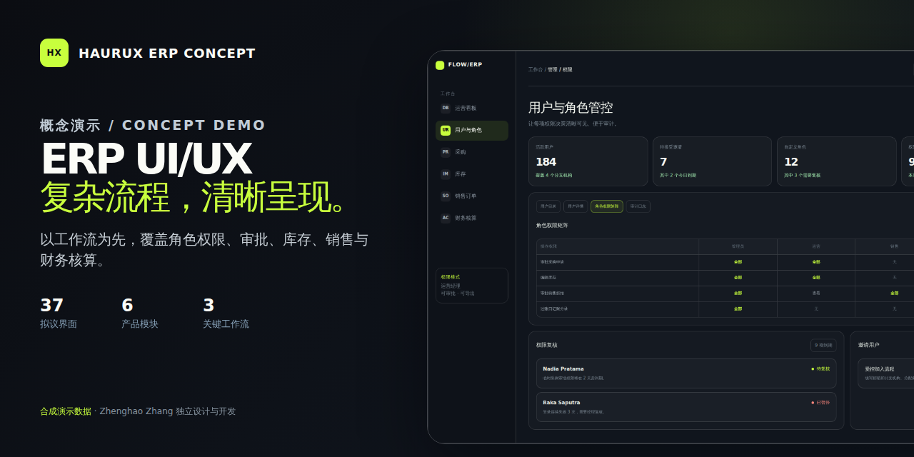
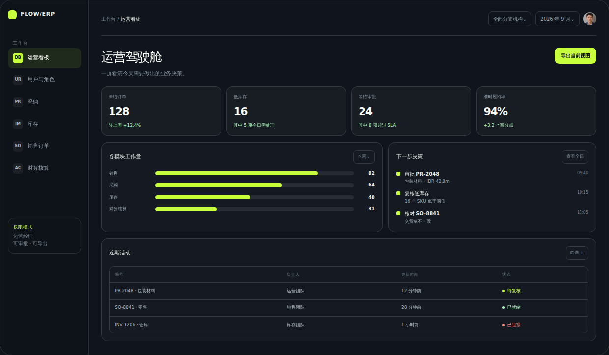
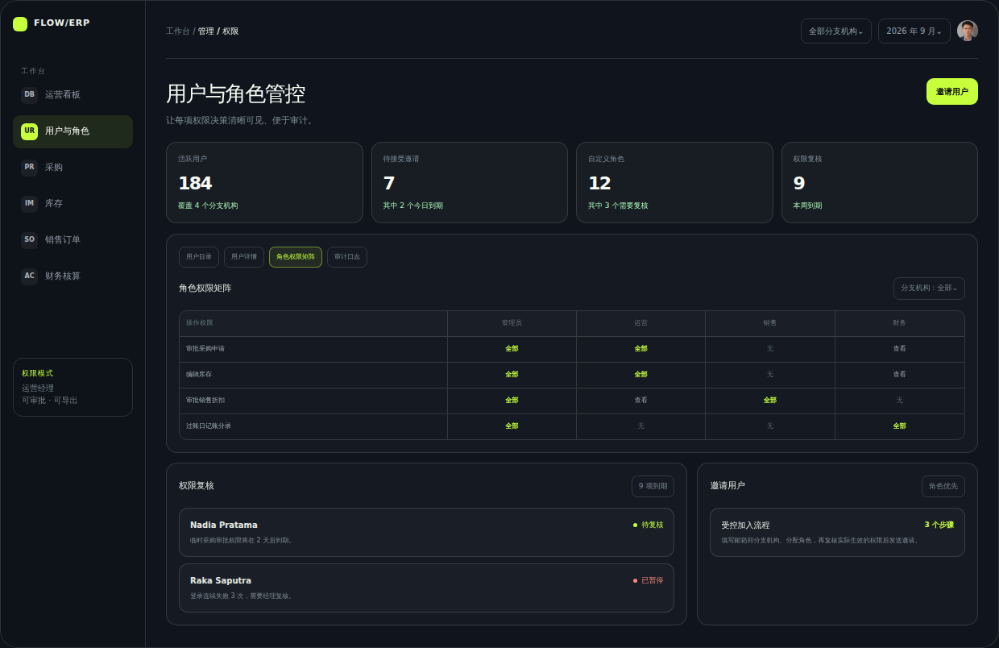
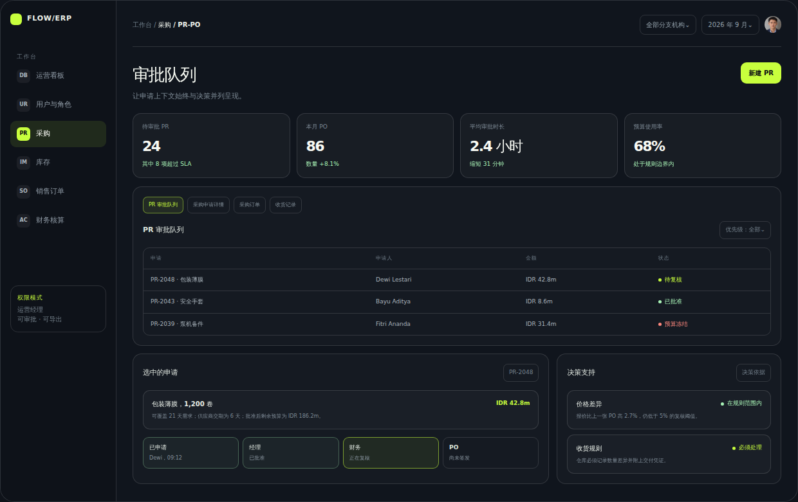
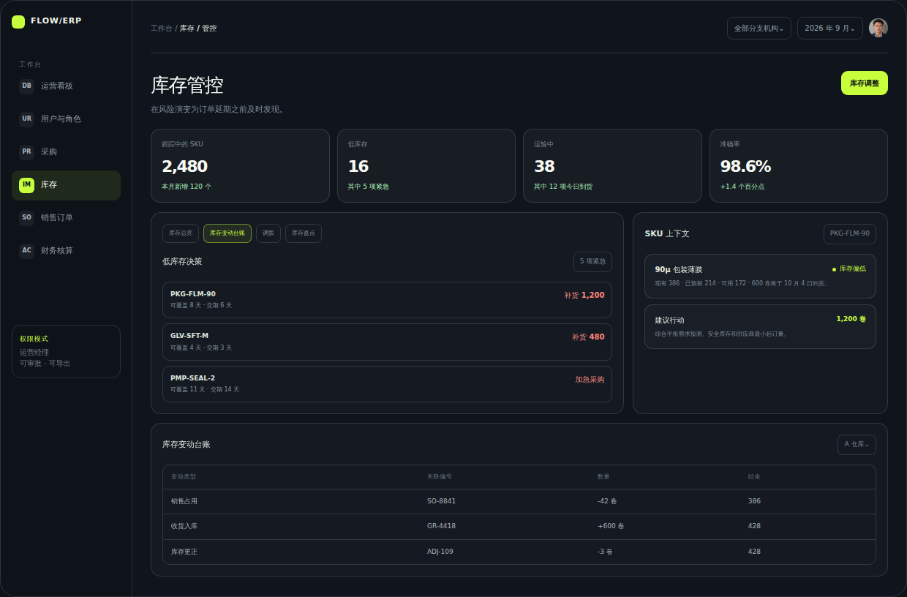
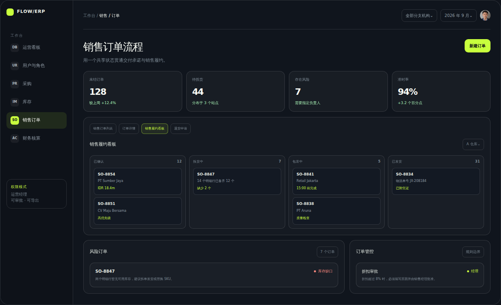
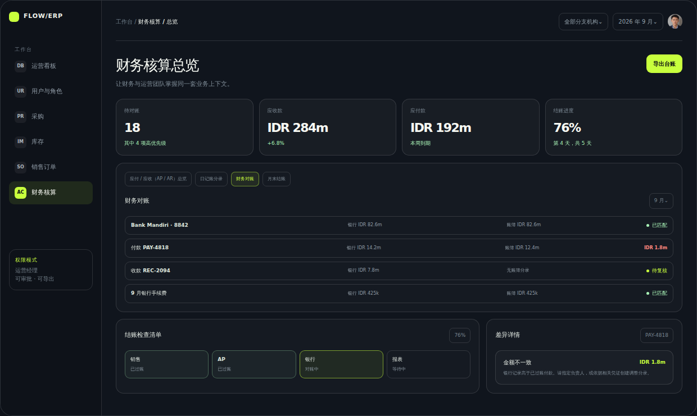
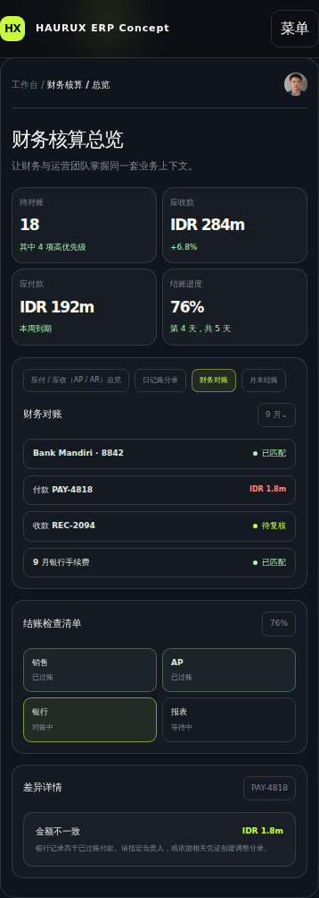

# HAURUX ERP Concept

## ERP UI/UX 概念作品集

[English](README.md) | [简体中文](README.zh-CN.md)

**概念演示（Concept / Demo）** | 响应式 Web ERP | 37 个界面的信息架构 | 三条连贯工作流



这份以设计证据为核心的案例分析，探索复杂 ERP 如何让角色、审批、运营风险和跨模块交接更容易理解。作品包含可操作的前端原型、拟议的 37 个界面架构、来自真实原型的界面截图，以及可下载的中文作品集。

本概念由 **Zhenghao Zhang** 独立设计与实现；HAURUX 仅作为该自主项目的品牌名称。

[**打开中文在线演示**](https://zhang-zhenghao.github.io/haurux-erp-portfolio/zh/) | [**下载中文 PDF**](https://zhang-zhenghao.github.io/haurux-erp-portfolio/assets/HAURUX_ERP_UIUX_Portfolio_zh-CN.pdf) | [**阅读中文案例分析**](CASE_STUDY.zh-CN.md) | [**查看英文版**](README.md)

> 本作品为根据有限公开需求自主制作的概念演示（Concept / Demo），使用合成演示数据（Synthetic data）。它不代表真实客户项目、正式上线系统或已经验证的业务成果。

## 设计挑战

ERP 工作很少停留在一个界面内。一份申请会进入审批，采购订单会转为收货记录，销售承诺会变成仓库任务，实物移动最终还要形成财务记录。界面需要在这些变化中保留责任人、业务上下文和追溯关系，同时避免让不同角色被无关信息淹没。

本概念聚焦六个可审查的产品区域：

- **运营看板：** 把运营信号整理为有优先级的决策队列。
- **用户与角色：** 清楚呈现权限、角色分配和权限复核状态。
- **PR / PO：** 在申请、审批、采购和收货过程中保留完整上下文。
- **库存：** 连接库存风险、移动历史和补货行动。
- **销售：** 让销售与仓库共享同一套履约状态。
- **财务核算：** 将对账异常连接回来源记录。



## 37 个界面的拟议范围

信息架构把“界面”定义为围绕一项明确工作任务的独立路由或工作台。抽屉、弹窗、筛选器和界面状态属于可复用变体，不被重复计算为新的界面。

| 区域 | 界面数 | 覆盖范围 |
| --- | ---: | --- |
| 基础与导航 | 5 | 登录、个人资料、搜索、通知、活动与审计 |
| 用户与权限 | 5 | 用户目录、用户设置、用户详情、角色、权限复核 |
| 销售 | 8 | 看板、客户、报价、订单、履约 |
| PR / PO | 8 | 申请、审批、RFQ、供应商比较、订单、收货 |
| 库存管理（IMS） | 6 | 总览、物料主数据、库存卡、仓库、调拨、盘点 |
| 财务核算 | 5 | 看板、应付、应收、日记账、对账 |
| **合计** | **37** | 在调研阶段继续验证的拟议基线 |

这张架构图用于说明范围和关系，并不表示已经交付 37 个生产级界面。在线原型只选择最具代表性的高价值模式，让系统方向在扩展前可以被实际审查。

## 三条连贯工作流

1. **采购管控：** 采购申请 -> 审批 -> RFQ 与比较 -> 采购订单 -> 收货 -> 入库与匹配。
2. **销售履约：** 销售订单 -> 拣货 -> 包装 -> 发货，并持续呈现责任人、风险和交付凭证。
3. **库存补货：** 低库存预警 -> 需求与交期复核 -> 补货决策 -> 预计到货与收货跟踪。

每次交接都保留下一个决策、负责角色、来源记录和异常状态，避免工作在模块之间失去上下文。

## 界面证据

| 基于角色的权限 | 采购审批 |
| --- | --- |
|  |  |
| 有效权限与有时限的权限复核 | 申请上下文、审批进度和差异依据 |

| 库存管控 | 销售履约 |
| --- | --- |
|  |  |
| 库存移动、需求上下文和建议行动 | 从确认到发货的共享订单状态 |

| 财务对账 | 移动端优先级 |
| --- | --- |
|  |  |
| 与来源记录相连的匹配结果和可见差异 | 在窄屏中重排后的优先信息 |

## 设计决策

- **决策优先的看板：** 先说明什么需要关注、为什么重要，以及下一步由谁负责。
- **基于角色的权限：** 分开定义查看、处理、审批和管理能力，而不是只依赖界面是否可见。
- **把上下文放在操作旁边：** 在审批控件附近呈现金额、规则、历史、差异和来源单据。
- **高密度但仍易读：** 使用稳定的表格模式、清晰层级、渐进呈现和一致的数字格式。
- **可追溯的交接：** 工作跨模块流转时保留单据引用和状态变化。
- **明确的界面状态：** 定义空状态、加载、错误和只读行为，并给出恢复路径。
- **响应式优先级：** 在小屏中重排决策内容，而不是强行压缩桌面表格。

原型还包含清晰的键盘焦点、跳至主要内容链接、语义化控件、状态颜色之外的文字标签、实时区域反馈和减少动态效果支持。这些是已经实现的设计考虑，不代表已经取得正式无障碍认证。

## 本地运行

作品集是静态 HTML、CSS 和 JavaScript 项目，不依赖应用服务器或数据库。

```bash
git clone https://github.com/zhang-zhenghao/haurux-erp-portfolio.git
cd haurux-erp-portfolio
export PORT=8765
python3 -m http.server "$PORT" --bind 0.0.0.0
```

英文版打开 `http://localhost:8765/`，中文版打开 `http://localhost:8765/zh/`。

## 验证仓库

运行完整合同测试：

```bash
python3 -m unittest discover -s tests -v
```

这些合同检查静态托管产品、ERP 核心内容、交互钩子、公开文档、界面证据、分享元数据和发布文件边界。

## 仓库导览

| 路径 | 用途 |
| --- | --- |
| `index.html` | 英文交互式作品集与 ERP 原型 |
| `zh/index.html` | 中文交互式作品集与 ERP 原型 |
| `portfolio-print.zh-CN.html` | 中文 PDF 的九页打印版源文件 |
| `assets/HAURUX_ERP_UIUX_Portfolio_zh-CN.pdf` | 可下载的中文作品集 |
| `docs/images/zh-CN/` | 从中文原型生成的桌面端和移动端截图 |
| `CASE_STUDY.zh-CN.md` | 中文设计依据、工作流、状态和边界说明 |
| `tests/` | 可执行的内容与发布合同 |

## 诚信与权利边界

ERP 界面中的组织、人物、记录、数值和绩效数据均为合成演示数据（Synthetic data）。本作品展示设计方法与前端实现能力。最终角色、规则、字段、集成方式和生产级界面都需要经过利益相关方调研与验证。

源代码按 MIT License 提供。人物肖像、截图、PDF、案例分析文字和视觉设计保留所有权利。权威授权边界以英文 [LICENSE.md](LICENSE.md) 为准；本中文说明不构成替代许可文本。

## 联系方式

如需沟通项目，可通过 X 或你发现此作品集的招聘平台联系我，也可以[查看我的 GitHub 主页](https://github.com/zhang-zhenghao)。
